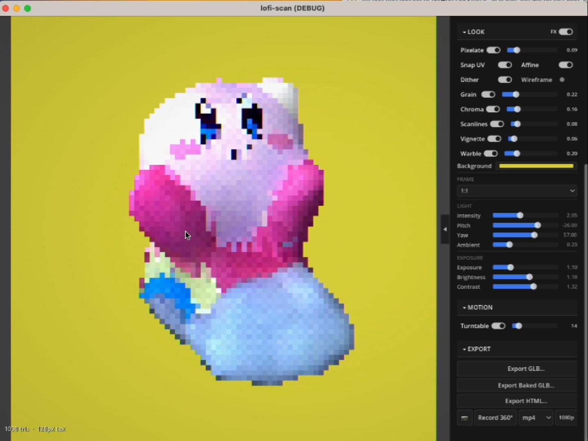
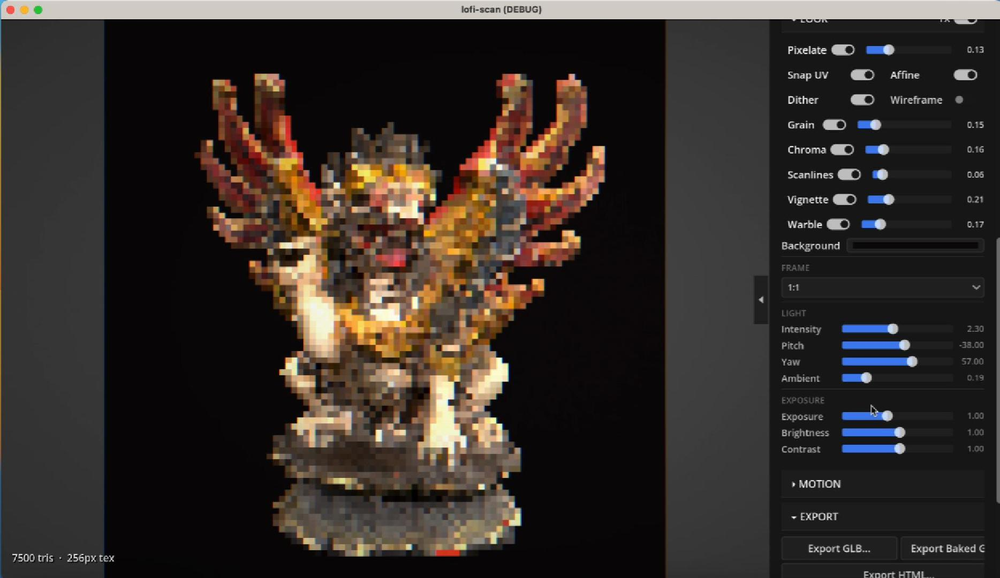

# lofi-scan

> PSX-style 3D scan converter. Prototype / research tool.

https://github.com/user-attachments/assets/ac5bf576-01f8-4844-8209-5791f0b12224

**[Project Page](https://rendyrayana.my.id/lofi-scan)** · **[Rendy Rayana](https://rendyrayana.my.id)**

---

## Overview

lofi-scan takes hi-res 3D-scanned objects and converts them into PS1-style low-poly, low-res assets. Instead of fixed presets, it runs a per-object adaptive search to find the minimum polygon count and texture resolution that still keeps the object recognizable. Built as a research tool and interactive viewer, currently in active development.

---

## Screenshots

| | |
|---|---|
|  |  |
| *PSX shader with dithering and CRT effects* | *High-detail model — Barong* |

---

## Features

- Adaptive decimation: finds the minimum poly count and texture resolution per object, rather than fixed presets
- Real-time PSX shader: vertex snapping, affine UV mapping, ordered dithering, and CRT effects in the viewport
- Texture baking: hi-res to lo-res bake via Blender headless; preserves original UVs through COLLAPSE decimation
- Color 3D print export: .3mf with per-face vertex colors, palette quantization, and optional mesh subdivision
- Turntable video export: records 360° rotation and encodes to mp4 or gif via Python, no ffmpeg install required
- HTML viewer export: self-contained interactive 3D viewer with PSX effects for sharing

---

## What Makes This Different

Most PSX-style converters apply a fixed poly count or texture size. lofi-scan treats conversion as a search problem: it finds the minimum settings that still preserve recognizability for each specific object, which varies significantly across geometry types. The result log makes it usable as a repeatable research pipeline, not just a one-off aesthetic filter.

---

## Requirements

- Godot 4.x
- Blender 3.6 or later
- Python 3.10+

```bash
pip install Pillow numpy scikit-image
```

---

## Getting Started

```bash
git clone https://github.com/rendyrayana/lofi-scan
cd lofi-scan
pip install Pillow numpy scikit-image
```

Open `godot_app/project.godot` in Godot 4. Set the Blender path in the app settings if it is not on your PATH.

---

## Tech Stack

| Library / Tool | Role |
|---|---|
| [Godot 4](https://godotengine.org) | UI, real-time 3D viewer, shader rendering, export orchestration |
| GLSL (PSX shader) | Vertex snapping, affine UV, dithering, CRT post-processing |
| [Blender](https://blender.org) (headless) | Mesh decimation, hi-to-lo texture baking |
| Python + NumPy | Texture processing, 3MF color quantization, video encoding |

---

## Status

`Prototype` — built as part of ongoing research into perceptual quality thresholds for stylized 3D assets. Not production-ready. Feedback and issues welcome.

---

## License

[MIT](LICENSE)

---

## Links

- **Project page:** [rendyrayana.my.id/lofi-scan](https://rendyrayana.my.id/lofi-scan)
- **More projects:** [rendyrayana.my.id](https://rendyrayana.my.id)
